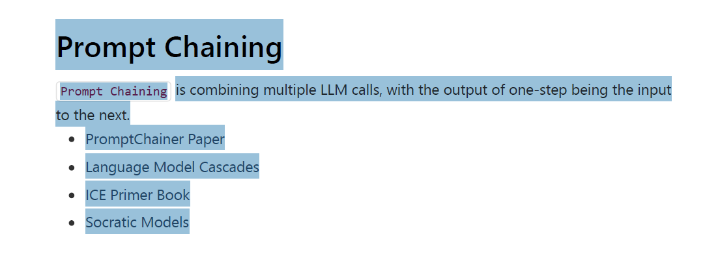
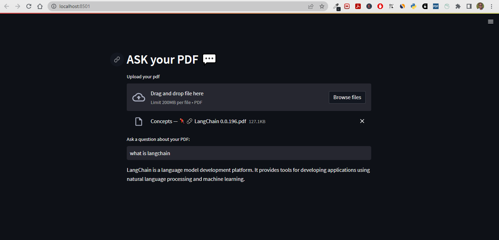
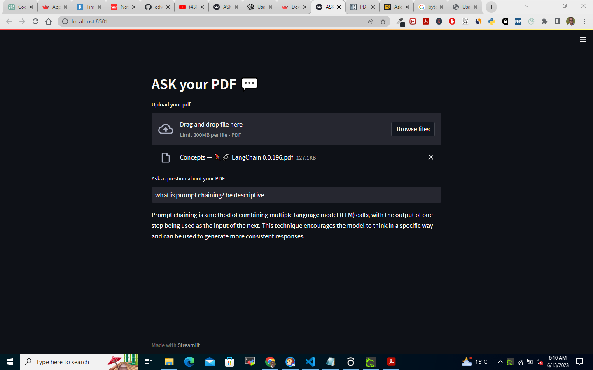

## Documentation :memo:

### Purpose :dart:

The purpose of this code is to create a Streamlit application that allows users to upload a PDF file and ask questions about its contents. The code utilizes the `langchain` library to perform question-answering on the PDF text.

### Dependencies :wrench:

The code requires the following dependencies:

- `langchain==0.0.198`: The LangChain library for natural language processing and understanding. :speech_balloon:
- `openai==0.27.8`: The OpenAI library for language models and AI capabilities. :robot:
- `PyPDF2==3.0.1`: The PyPDF2 library for reading PDF files. :page_facing_up:
- `python-dotenv==1.0.0`: The Dotenv library for loading environment variables from a `.env` file. :closed_lock_with_key:
- `streamlit==1.23.1`: The Streamlit library for building interactive web applications. :globe_with_meridians:
- `tiktoken==0.4.0`: The Tiktoken library for counting tokens in text. :abacus:
- `faiss-cpu==1.7.4`: The FAISS library for efficient similarity search and clustering. :mag_right:

### `extract_text_from_pdf` Function :open_file_folder:

The `extract_text_from_pdf` function extracts text from a PDF file.

#### Parameters

- `pdf` (File): The PDF file to extract text from.

#### Returns

- `str`: Extracted text from the PDF.

### `main` Function :computer:

The `main` function is the entry point of the program. It performs the following steps:

1. Loads the environment variables from the `.env` file using `load_dotenv()`. :gear:

2. Sets the Streamlit page configuration, including the page title and header. :page_with_curl:

3. Prompts the user to upload a PDF file using the Streamlit `file_uploader` function. The uploaded file is stored in the `pdf` variable. :inbox_tray:

4. If a PDF file is uploaded (`pdf` is not `None`), the code extracts the text from the PDF using the `extract_text_from_pdf` function. :page_with_curl:

5. Splits the extracted text into chunks that overlap using the `CharacterTextSplitter` from the `langchain` library. :scissors:

6. Creates embeddings from the text chunks to form the knowledge base using the `OpenAIEmbeddings` class from `langchain`. :bulb:

7. Prompts the user to ask a question about the PDF using the Streamlit `text_input` function. The question is stored in the `user_question` variable. :speech_balloon:

8. If a user question is provided (`user_question` is not empty), the code performs a similarity search in the knowledge base to find relevant documents using the `similarity_search` method. :mag_right:

9. Loads the question-answering chain from `langchain` library. :chains:

10. Runs the question-answering chain on the input documents and user's question using the `run` method. The response is stored in the `response` variable. :question:

11. Displays the response using the Streamlit `write` function. :speech_balloon:

### Running the Code :rocket:

To run the code:

1. Ensure that all the required dependencies are installed by running:  
   `pip install langchain==0.0.198 openai==0.27.8 PyPDF2==3.0.1 python-dotenv==1.0.0 streamlit==1.23.1 tiktoken==0.4.0 faiss-cpu==1.7.4` :heavy_check_mark:

2. Save the code in a Python file, for example, `app.py`. :floppy_disk:

3. Open a command prompt or terminal and navigate to the directory containing the Python file. :file_folder:

4. Run the command:
   `streamlit run app.py` :arrow_forward:

5. The Streamlit application will start, and you can interact with it by uploading a PDF file and asking questions about it. The output will be displayed on the web interface. :computer:

Note: Make sure to have the necessary PDF files and replace the `.env` file with your specific environment variables, if required.

### PDF file located [@link]("pdf/concepts.pdf")

### Example Questions and Response from pdf above

    
    
   
   

